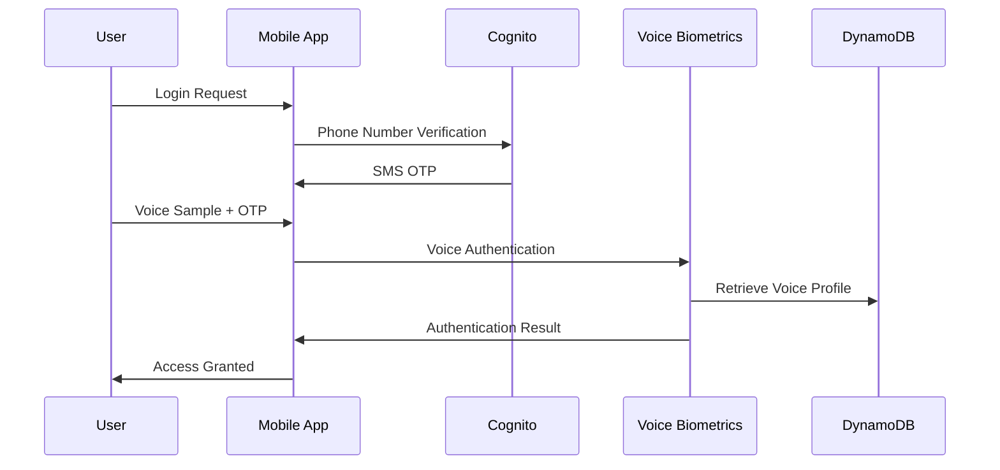
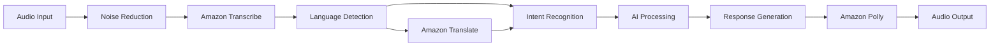
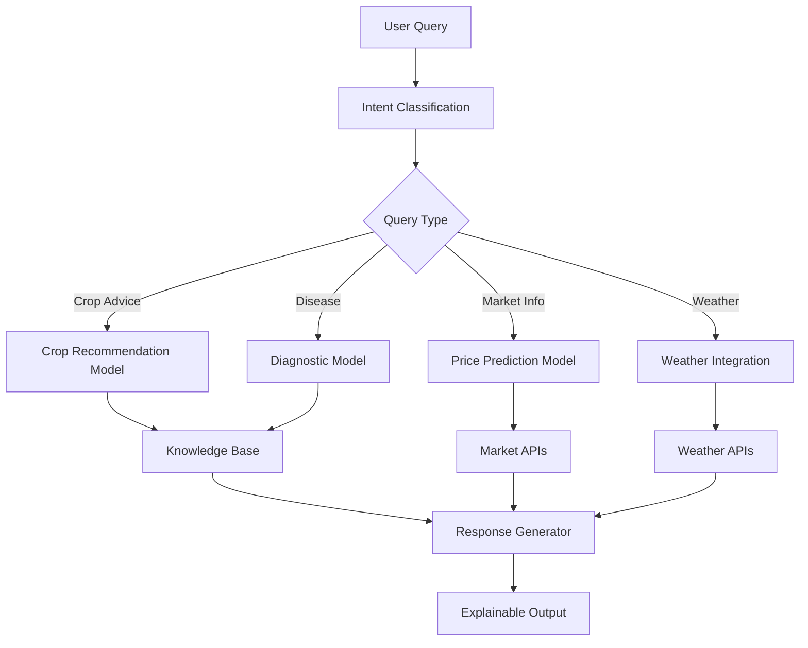
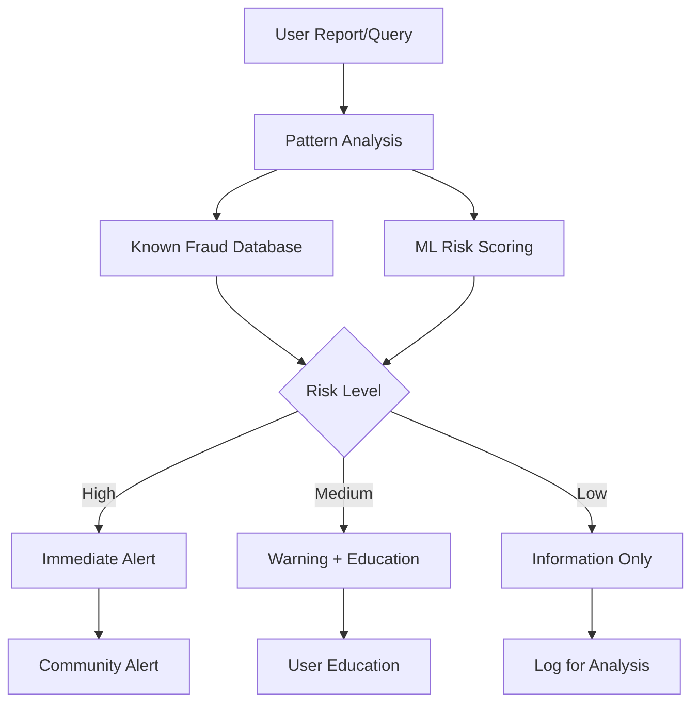
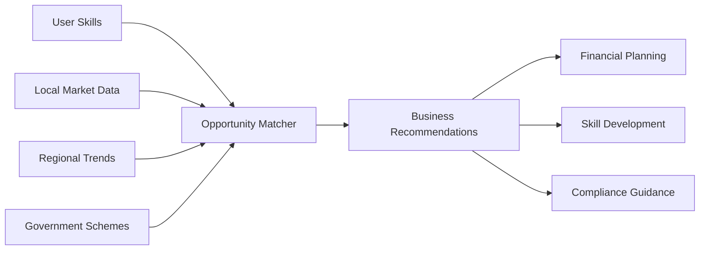
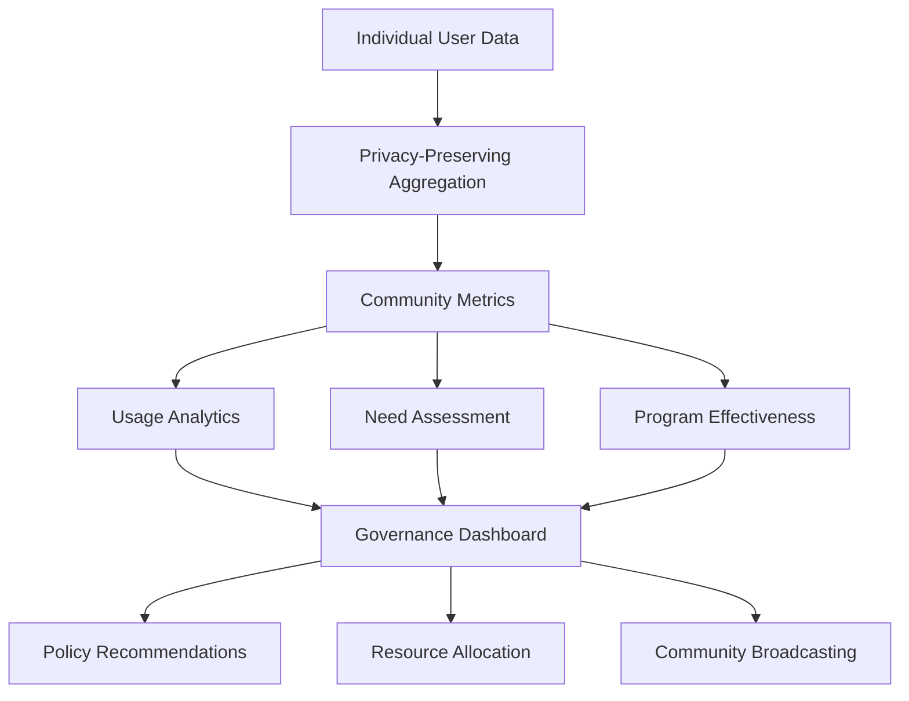
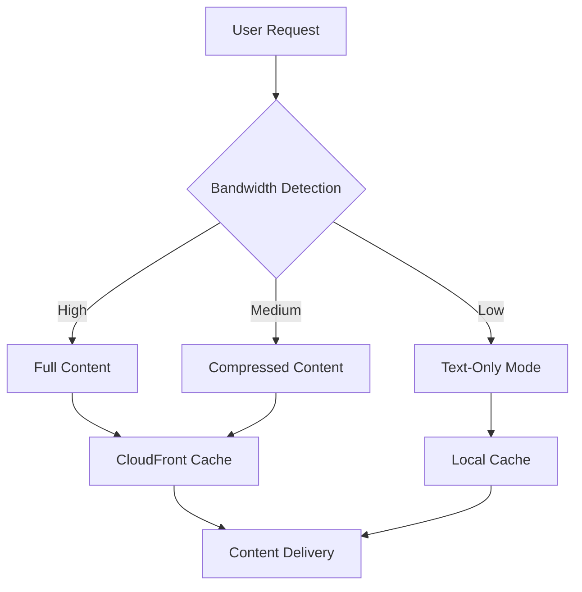
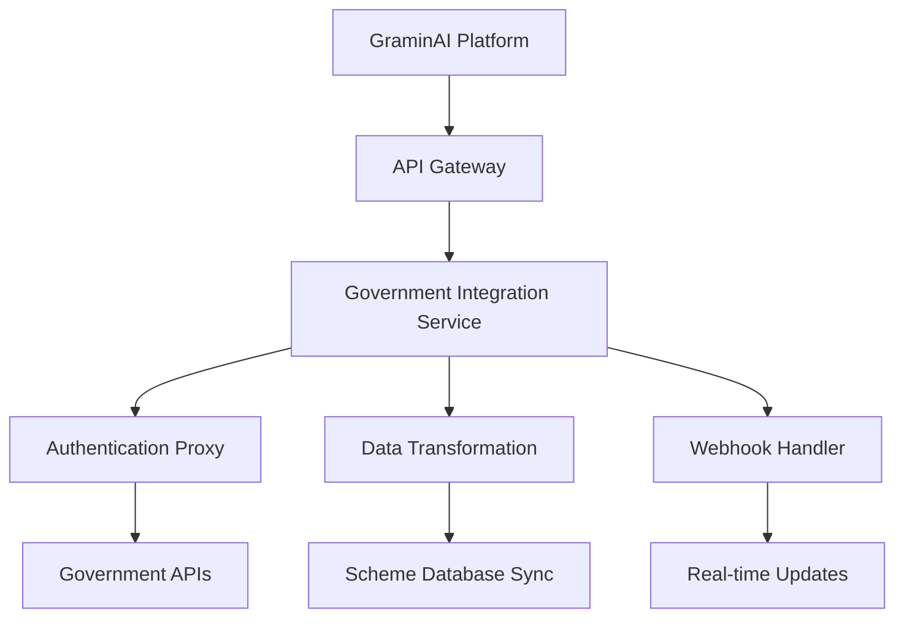
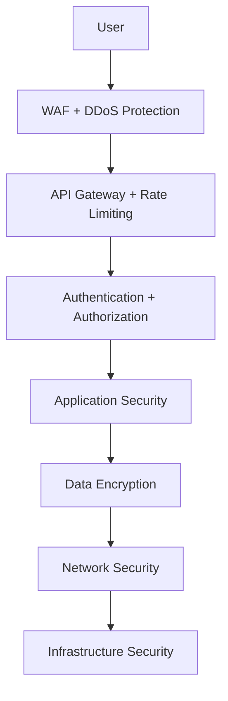
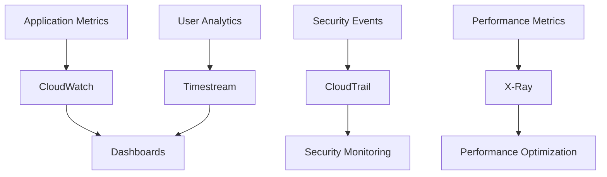

# Design Document

## Overview

GraminAI is a comprehensive rural AI platform built on AWS cloud infrastructure, leveraging Amazon Bedrock and Amazon Q as the core AI engines. The platform provides a unified, voice-first, multilingual interface serving farmers, rural households, small business owners, healthcare users, and government officials across diverse rural communities.

The system architecture follows a serverless, microservices approach optimized for scalability, low-bandwidth environments, and government-grade security. The platform integrates multiple AI-powered services including agricultural intelligence, healthcare management, government scheme awareness, fraud detection, and community governance tools.

**Design Rationale**: The serverless architecture ensures cost-effectiveness for rural deployments with variable usage patterns, while the microservices approach enables independent scaling of different functional domains (agriculture, healthcare, governance) based on regional needs.

## Architecture

### High-Level Architecture

```mermaid
graph TB
    subgraph "Client Layer"
        MA[Mobile App - PWA]
        FP[Feature Phone Interface]
        VA[Voice Interface]
        USSD[USSD Gateway]
        WA[Web Dashboard]
    end
    
    subgraph "Edge & CDN"
        CF[CloudFront CDN]
        LZ[Lambda@Edge]
        AG[API Gateway]
    end
    
    subgraph "Authentication & Authorization"
        COG[Amazon Cognito]
        VB[Voice Biometrics]
        IAM[AWS IAM]
    end
    
    subgraph "Core AI Services"
        BR[Amazon Bedrock]
        AQ[Amazon Q Business]
        TR[Amazon Transcribe]
        PO[Amazon Polly]
        TL[Amazon Translate]
        CP[Amazon Comprehend]
    end
    
    subgraph "Business Logic Layer"
        LF1[User Management]
        LF2[AI Orchestration]
        LF3[Voice Processing]
        LF4[Notification Service]
        LF5[Analytics Engine]
        LF6[Fraud Detection]
        LF7[Government Integration]
        LF8[Community Dashboard]
    end
    
    subgraph "Data Layer"
        DDB[DynamoDB - User Profiles]
        S3[S3 - Voice/Media Storage]
        RDS[RDS - Government Schemes]
        ES[ElasticSearch - Knowledge Base]
        TS[Timestream - Analytics]
    end
    
    subgraph "External Integrations"
        GOV[Government APIs]
        WTH[Weather Services]
        MKT[Market Data APIs]
        SMS[SMS Gateway]
        PUSH[Push Notifications]
    end
    
    MA --> CF
    FP --> USSD
    VA --> AG
    WA --> CF
    
    CF --> AG
    AG --> COG
    AG --> LF1
    AG --> LF2
    
    LF2 --> BR
    LF2 --> AQ
    LF3 --> TR
    LF3 --> PO
    LF3 --> TL
    
    LF1 --> DDB
    LF2 --> ES
    LF4 --> SMS
    LF4 --> PUSH
    LF5 --> TS
    LF6 --> DDB
    LF7 --> GOV
    LF7 --> RDS
    
    LF2 --> WTH
    LF2 --> MKT
```

### Component Design Decisions

**Client Layer Design Rationale**:
- **Progressive Web App (PWA)**: Enables app-like experience without app store dependency, addressing Requirement 14 (Mobile-First Design)
- **Feature Phone Interface**: USSD gateway ensures accessibility for users with basic phones, supporting digital inclusion
- **Voice Interface**: Primary interaction method for low-literacy users, fulfilling Requirement 2 (Voice-First Interface)

**Edge Computing Strategy**:
- **Lambda@Edge**: Processes requests closer to users, reducing latency for rural areas with poor connectivity
- **CloudFront CDN**: Caches static content and optimizes delivery for low-bandwidth scenarios (Requirement 10)

**AI Services Integration**:
- **Amazon Bedrock**: Provides foundation models for general AI capabilities with explainable outputs (Requirement 11)
- **Amazon Q Business**: Handles domain-specific queries with enterprise-grade security
- **Multi-language Support**: Transcribe, Polly, and Translate enable 10+ regional languages (Requirement 2)

## Core Services Design

### 1. User Authentication and Profile Management

**Service**: User Management Lambda + Amazon Cognito + Voice Biometrics

**Design Rationale**: Multi-modal authentication accommodates varying literacy levels and device capabilities in rural areas.

**Components**:
- **Amazon Cognito**: Handles standard authentication flows with phone number verification
- **Voice Biometrics**: Custom Lambda function using Amazon Transcribe for voice pattern recognition
- **Profile Storage**: DynamoDB with encryption at rest for personal data (Requirement 13)

**Authentication Flow**:


**Key Features**:
- Multi-factor authentication (phone + voice + PIN)
- Encrypted profile storage with user consent management
- Family account linking for healthcare tracking
- Offline authentication caching for low-connectivity scenarios

### 2. Voice-First Multilingual Interface

**Service**: Voice Processing Lambda + Amazon Transcribe + Amazon Polly + Amazon Translate

**Design Rationale**: Voice-first design removes literacy barriers while multilingual support ensures cultural accessibility.

**Supported Languages**: Hindi, Bengali, Tamil, Telugu, Marathi, Gujarati, Kannada, Malayalam, Punjabi, Odia (expandable architecture)

**Voice Processing Pipeline**:


**Key Features**:
- 95% accuracy target with noise handling for rural environments
- Automatic language detection with user confirmation
- Context-aware responses maintaining conversation flow
- Audio compression for low-bandwidth transmission

### 3. Agricultural Intelligence System

**Service**: AI Orchestration Lambda + Amazon Bedrock + External APIs

**Design Rationale**: Combines AI reasoning with real-time data to provide actionable agricultural guidance.

**Data Sources**:
- Weather APIs for climate-based recommendations
- Market price APIs for economic guidance
- Soil and crop databases for personalized advice
- Government agricultural schemes database

**AI Model Architecture**:


**Key Features**:
- Personalized crop recommendations based on location and soil type
- Real-time market price integration with trend analysis
- Disease diagnosis with treatment recommendations
- Sustainable farming practice suggestions

### 4. Healthcare Management System

**Service**: Notification Service + DynamoDB + Government Health APIs

**Design Rationale**: Proactive healthcare management through automated reminders and family health tracking.

**Healthcare Data Model**:
```json
{
  "familyId": "string",
  "members": [
    {
      "memberId": "string",
      "name": "string",
      "age": "number",
      "vaccinations": [
        {
          "vaccine": "string",
          "dueDate": "date",
          "completed": "boolean",
          "remindersSent": "number"
        }
      ],
      "medications": [
        {
          "medication": "string",
          "schedule": "string",
          "adherence": "number"
        }
      ]
    }
  ]
}
```

**Reminder System**:
- Multi-channel notifications (voice calls, SMS, app notifications)
- Escalating reminder frequency for critical vaccinations
- Integration with government health databases for record synchronization
- Emergency contact system for health crises

### 5. Government Scheme Awareness Engine

**Service**: Government Integration Lambda + RDS + Amazon Q Business

**Design Rationale**: Centralized scheme database with AI-powered eligibility matching and application guidance.

**Scheme Database Schema**:
```sql
CREATE TABLE government_schemes (
    scheme_id VARCHAR(50) PRIMARY KEY,
    scheme_name VARCHAR(200),
    description TEXT,
    eligibility_criteria JSON,
    application_process JSON,
    required_documents JSON,
    deadline DATE,
    state_code VARCHAR(10),
    category VARCHAR(50),
    active BOOLEAN
);

CREATE TABLE user_eligibility (
    user_id VARCHAR(50),
    scheme_id VARCHAR(50),
    eligibility_score DECIMAL(3,2),
    missing_criteria JSON,
    application_status VARCHAR(20),
    PRIMARY KEY (user_id, scheme_id)
);
```

**Eligibility Matching Algorithm**:
- Rule-based matching using user demographics
- AI-powered similarity scoring for complex criteria
- Proactive notifications for new scheme launches
- Step-by-step application guidance with document checklists

### 6. Fraud Detection and Prevention

**Service**: Fraud Detection Lambda + DynamoDB + Machine Learning Models

**Design Rationale**: Proactive fraud prevention using pattern recognition and community reporting.

**Fraud Detection Pipeline**:


**Key Features**:
- Real-time fraud pattern matching
- Community-based reporting system
- Educational content delivery
- Integration with law enforcement databases

### 7. Small Business Support System

**Service**: AI Orchestration Lambda + Market Data APIs + Skill Development APIs

**Design Rationale**: Comprehensive business support combining market intelligence with skill development opportunities.

**Business Intelligence Components**:
- Local market demand analysis
- Skill-based business recommendations
- Financial planning guidance
- Regulatory compliance assistance

**Market Analysis Model**:


### 8. Circular Economy and Waste Management

**Service**: AI Orchestration Lambda + Location Services + Waste Management APIs

**Design Rationale**: Promotes sustainable practices while creating economic opportunities from waste.

**Waste-to-Value Pipeline**:
- Waste categorization and disposal guidance
- Local recycling center mapping
- Income opportunity identification
- Environmental impact tracking

### 9. Community Governance Dashboard

**Service**: Community Dashboard Lambda + Analytics Engine + Timestream

**Design Rationale**: Data-driven governance tools while maintaining individual privacy through aggregation.

**Dashboard Components**:


**Privacy Protection**:
- Differential privacy for sensitive aggregations
- Role-based access control for governance users
- Audit logging for all administrative actions

### 10. Low-Bandwidth Optimization

**Service**: Lambda@Edge + CloudFront + Local Caching

**Design Rationale**: Adaptive content delivery optimized for varying connectivity conditions.

**Optimization Strategies**:


**Key Features**:
- Automatic bandwidth detection and adaptation
- Progressive content loading
- Offline-first architecture with sync queues
- Voice compression for audio interactions

## Data Architecture

### Data Storage Strategy

**Design Rationale**: Multi-database approach optimized for different data types and access patterns.

**Storage Mapping**:
- **DynamoDB**: User profiles, authentication data, real-time interactions
- **RDS**: Government schemes, structured reference data
- **S3**: Voice recordings, media content, document storage
- **ElasticSearch**: Knowledge base, searchable content
- **Timestream**: Analytics data, usage metrics

### Data Security and Privacy

**Encryption Strategy**:
- Data at rest: AES-256 encryption for all storage services
- Data in transit: TLS 1.3 for all API communications
- Voice data: Encrypted with user-specific keys, automatic deletion after processing

**Privacy Controls**:
- Explicit consent management for all data collection
- Granular data sharing controls for government integration
- Right to deletion with cascading cleanup
- Data minimization principles in collection and retention

## Scalability and Performance

### Horizontal Scaling Design

**Auto-scaling Configuration**:
```yaml
Lambda Functions:
  - Concurrent Executions: 10,000 per region
  - Memory: 512MB - 3GB based on function type
  - Timeout: 15 minutes for batch processing

DynamoDB:
  - On-demand billing for variable workloads
  - Global tables for multi-region deployment
  - Point-in-time recovery enabled

API Gateway:
  - Rate limiting: 10,000 requests per second
  - Caching: 5-minute TTL for static responses
  - Regional endpoints for latency optimization
```

**Performance Targets**:
- API Response Time: < 500ms for 95% of requests
- Voice Processing: < 2 seconds end-to-end
- System Availability: 99.9% uptime
- Concurrent Users: 1M+ across all regions

### Multi-Region Deployment

**Regional Strategy**:
- Primary regions: Mumbai, Delhi, Bangalore, Chennai
- Data residency compliance for government requirements
- Cross-region replication for disaster recovery
- Edge locations for content delivery optimization

## Integration Architecture

### Government System Integration

**Integration Patterns**:


**Integration Features**:
- Standardized API adapters for different government systems
- Real-time data synchronization with fallback mechanisms
- Audit trail for all government data exchanges
- Compliance monitoring and reporting

### External Service Integration

**Third-party Services**:
- Weather APIs: OpenWeatherMap, IMD
- Market Data: APMC, commodity exchanges
- SMS Gateway: AWS SNS, Twilio
- Payment Integration: UPI, digital wallets

## Security Architecture

### Security Layers

**Defense in Depth Strategy**:


**Security Controls**:
- Web Application Firewall (WAF) for attack prevention
- Identity and Access Management (IAM) with least privilege
- VPC isolation for sensitive components
- Security monitoring and incident response
- Regular security assessments and penetration testing

### Compliance Framework

**Regulatory Compliance**:
- Data Protection: IT Act 2000, Personal Data Protection Bill
- Government Integration: Digital India compliance
- Financial Services: RBI guidelines for digital payments
- Healthcare: Medical data privacy regulations

## Monitoring and Analytics

### Observability Stack

**Monitoring Components**:


**Key Metrics**:
- User engagement and retention rates
- Service availability and performance
- AI model accuracy and response quality
- Security incident detection and response
- Cost optimization and resource utilization

### Analytics and Insights

**Community Analytics**:
- Aggregated usage patterns for governance insights
- Service effectiveness measurement
- User satisfaction and feedback analysis
- Regional adoption and growth metrics

## Deployment and DevOps

### CI/CD Pipeline

**Deployment Strategy**:


**Infrastructure as Code**:
- AWS CDK for infrastructure provisioning
- Automated testing for all components
- Blue-green deployment for zero-downtime updates
- Automated rollback mechanisms for failed deployments

### Disaster Recovery

**Business Continuity Plan**:
- Multi-region active-passive setup
- Automated failover for critical services
- Data backup and recovery procedures
- Regular disaster recovery testing

## Cost Optimization

### Cost Management Strategy

**Optimization Techniques**:
- Serverless architecture for variable workloads
- Reserved capacity for predictable usage
- Automated resource scaling based on demand
- Regular cost analysis and optimization reviews

**Estimated Cost Structure**:
- Compute: 40% (Lambda, containers)
- Storage: 25% (DynamoDB, S3, RDS)
- AI Services: 20% (Bedrock, Transcribe, Polly)
- Networking: 10% (CloudFront, data transfer)
- Other Services: 5% (monitoring, security)

## Future Enhancements

### Roadmap Considerations

**Phase 2 Features**:
- Advanced AI models for specialized domains
- Blockchain integration for transparent governance
- IoT sensor integration for smart agriculture
- Augmented reality for visual assistance
- Advanced analytics and predictive modeling

**Scalability Enhancements**:
- Edge computing for ultra-low latency
- 5G optimization for enhanced mobile experience
- Advanced caching strategies for offline capabilities
- Machine learning model optimization for edge deployment

This design document provides a comprehensive architecture that addresses all 14 requirements while maintaining scalability, security, and cost-effectiveness for rural deployment scenarios.